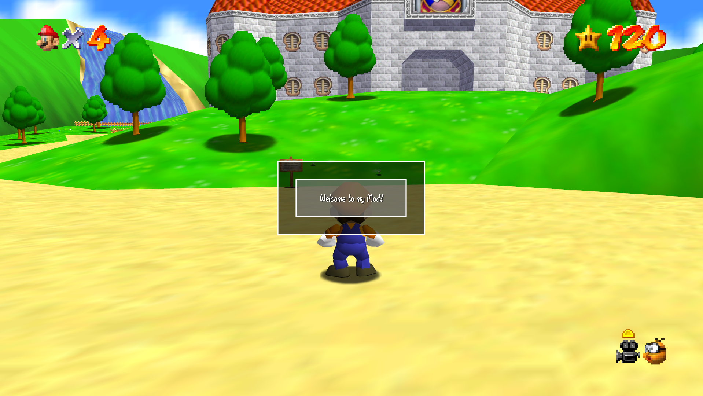
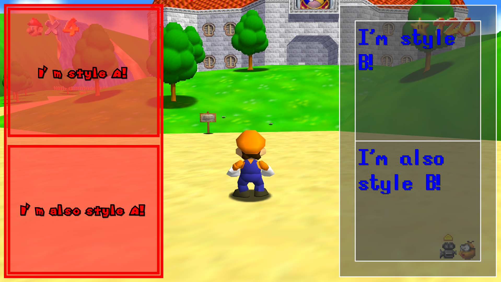

# SM64 Co-op DX UI Utils

SM64 Co-op DX UI Utils (or just UI Utils) Is a flexible, general purpose UI system for *Super Mario 64 Co-op Deluxe*. 

Instead of manually calculating every pixel coordinate for your HUD, UI Utils allows you to build interfaces using a hierarchical system of containers, stacks, and panels. It handles the tedious math of anchoring, padding, and alignment so you can focus on the design of your mod.

## 🚀 Key Features

- Layout Containers: Quickly organize elements using `VStack` (vertical), `HStack` (horizontal), and `Grid` layouts.
- Smart Anchoring: Easily pin elements to the center, corners, or edges of the screen or their parent containers.
- Dynamic Padding & Spacing: Built-in support for internal padding and gap spacing between elements.
- Flexible Fill Modes: Control how elements expand or shrink to fit their available space.
- Rich Text Support: Advanced text boxes with automatic word-wrapping, character-wrapping, and shadow effects.
- Component Hierarchy: A semi-OOP approach where elements can have children, allowing for complex, nested UI structures.

------

## 🛠️ The Core System

UI Utils is designed as a system, not a finished product. It provides the primitives needed to build any interface imaginable.

### Available Components

| Component | Description                                                  |
| :-------- | :----------------------------------------------------------- |
| `Screen`  | The root container that encompasses the entire display.      |
| `Panel`   | A basic rectangular area with customizable colors and borders. |
| `TextBox` | A panel specifically optimized for rendering formatted text. |
| `Texture` | An object that displays a texture.                           |
| `HStack`  | A layout container that aligns children horizontally.        |
| `VStack`  | A layout container that aligns children vertically.          |
| `Grid`    | A layout container that organizes children into rows and columns. |

------

## 💻 Quick Example

Here is how simple it is to create a centered, padded panel containing a text box:

lua

```lua
local M = {}
local ui_utils = require("ui_utils")

function M.init()
    -- Create the main screen
    local screen = ui_utils.create_screen()

    -- Create a centered panel
    local main_panel = ui_utils.create_panel({
        panel_color = {r = 0, g = 0, b = 0, a = 160},
        anchor_x = 0.5,
        anchor_y = 0.5,
        fill_mode = "no_fill",
        min_w = 400,
        min_h = 200,
        padding_x = 30,
        padding_y = 30,
    })

    -- Create a text box to put inside that panel
    local welcome_text = ui_utils.create_textbox({
        panel_color = {r = 128, g = 128, b = 128, a = 160},
        text = "Welcome to my Mod!",
        text_scale = 1,
        h_align = 0.5,
        v_align = 0.5,
        fill_mode = "no_fill",
        min_w = 300,
        min_h = 100,
    })

    -- Nest the text box inside the panel, and the panel inside the screen
    main_panel.children = {welcome_text}
    screen.children = {main_panel}

    M.screen = screen
end

function M.on_hud_render()
    M.screen:render() -- Render the screen (Updates UI in real time!)
end

M.init()
hook_event(HOOK_ON_HUD_RENDER, M.on_hud_render)

return M

```



------


## 🏗️ Architecture

The system utilizes a semi-OOP approach via Lua metatables. Each UI object maintains its own set of `defaults` and `arg_params`. When `render()` is called:

1. The system merges the defaults with your custom parameters.
2. It computes the absolute position based on the parent's dimensions and the element's anchoring/padding.
3. It renders the element and recursively tells all children to do the same.

## 🎨 Styling

Stop repeating yourself! UI Utils features a powerful styling system that allows you to define a "theme" as a Lua table and apply it to any component. This eliminates the need to manually define colors, fonts, and padding for every single element in your UI.

**Key Styling Capabilities:**

- **Centralized Themes:** Define a single style table (e.g., `style_a`) and reuse it across dozens of different panels and text boxes to ensure visual consistency.
- **Style Inheritance:** Styles cascade down the hierarchy. When you apply a style to a parent container, all of its children automatically inherit those parameters, even if the children don't use every property in the table. 
- **Granular Overrides:** You can apply a global style but still tweak specific elements. By passing a few modified parameters into a child component, you can override inherited values without breaking the overall theme.

Here is an example of creating two distinct themes and applying them to different UI branches:

```lua
-- This sytem allows for styling by pre defining a list of parameters!
-- By pre-defining parameters in a table, you can style an entire set of UI objects all at once!
-- Even if any particular object does not use all of the parameters, they are still passed down to its children.

-- Add the tool
local ui_utils = require("ui_utils")

local style_a = {
	panel_color = {r = 255, g = 64, b = 64, a = 128}, -- Red background
	border_color = {r = 255, g = 0, b = 0, a = 255}, -- Red border
	border_thickness = 10, -- Thick border
	min_w = 600,
	min_h = 600,
	padding_x = 7, -- Little padding
	padding_y = 7,
	spacing_y = 40, -- Huge spacing between the text boxes
	fill_mode = "h_fill",
	anchor_x = 0, -- Stick the entire panel to the left
	font = 1, -- High res font
	text_scale = 1,
	text_color = {r = 255, g = 0, b = 0, a = 255}, -- Red text
	h_align = 0.5, -- Center text alignment
	v_align = 0.5,
}

local style_b = {
	panel_color = {r = 64, g = 64, b = 64, a = 128}, -- Grey background
	border_color = {r = 255, g = 255, b = 255, a = 255}, -- White border
	border_thickness = 3, -- Thin border
	min_w = 600,
	min_h = 600,
	padding_x = 30, -- Lots of padding
	padding_y = 30,
	spacing_y = 0, -- No spacing between the text boxes
	fill_mode = "h_fill",
	anchor_x = 1, -- Stick the entire panel to the right
	font = 6, -- Pixel font
	text_scale = 3,
	text_color = {r = 0, g = 0, b = 255, a = 255}, -- Blue text
	h_align = 0, -- Top left text alignment
	v_align = 0,
}

-- The base UI object that acts as the entire screen
local screen = ui_utils.create_screen({
        padding_x = 20,
        padding_y = 20,
})

-- Draws a background panel
local style_a_panel = ui_utils.create_panel(style_a)
-- Creates a vertical stack container that inherits all style parameters from its parent (style a), but also modify a few midway
local style_a_vstack = ui_utils.create_v_stack({
	-- Overriding some inherited variables
	min_w = 1,
	min_h = 1,
	fill_mode = "fill",
	anchor_x = .5,
})

-- Draws a background panel
local style_b_panel = ui_utils.create_panel(style_b)
-- Creates a vertical stack container that inherits all style parameters from its parent (style b), but also modify a few midway
local style_b_vstack = ui_utils.create_v_stack({
	-- Overriding some inherited variables
	min_w = 1,
	min_h = 1,
	fill_mode = "fill",
	anchor_x = .5,
})

-- Draws two textboxes that inherit all style parameters from their parent
local style_a_textbox_1 = ui_utils.create_textbox({text = "I'm style A!"})
local style_a_textbox_2 = ui_utils.create_textbox({text = "I'm also style A!"})

-- Draws two textboxes that inherit all style parameters from their parent
local style_b_textbox_1 = ui_utils.create_textbox({text = "I'm style B!"})
local style_b_textbox_2 = ui_utils.create_textbox({text = "I'm also style B!"})

-- Add the textboxes to their stacks, add the stacks to the panels
style_a_vstack.children = {style_a_textbox_1, style_a_textbox_2}
style_a_panel.children = {style_a_vstack}

style_b_vstack.children = {style_b_textbox_1, style_b_textbox_2}
style_b_panel.children = {style_b_vstack}

-- Add panels to the screen
screen.children = {style_a_panel, style_b_panel}

-- Render the screen and its children every frame
function on_hud_render()
    screen:render()
end

hook_event(HOOK_ON_HUD_RENDER, on_hud_render)

```



## 📜 How to use in your own projects

Simply add these mandatory scripts into your project:

- ui_utils.lua
- ui_helpers.lua
- ui_screen.lua

As well as these object scripts:

- ui_container.lua
- ui_panel.lua
- ui_textbox.lua
- ui_texture.lua
- ui_hstack.lua
- ui_vstack.lua
- ui_grid.lua

In your main script (or dedicated UI script), include:

```lua
-- Add the tool
local ui_utils = require("ui_utils")

-- The base UI object that acts as the entire screen
local screen = ui_utils.create_screen()

-- Add UI objects to the screen
-- screen.children = {ui_object}

-- Render the screen and its children every frame
function on_hud_render()
	screen:render()
end

hook_event(HOOK_ON_HUD_RENDER, on_hud_render)
```

------


## 🤝 Contributing

This is an open-source project. Pull requests and issue reports are welcome!

If you feel that a feature is missing (such as buttons, sliders, drop down menus, progress bars, etc), feel free to fork the project and write in the object yourself!
